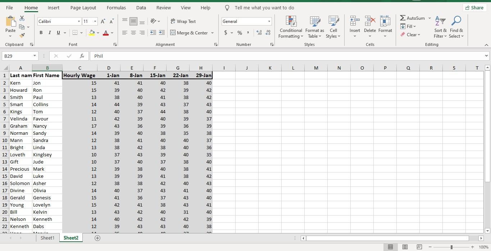
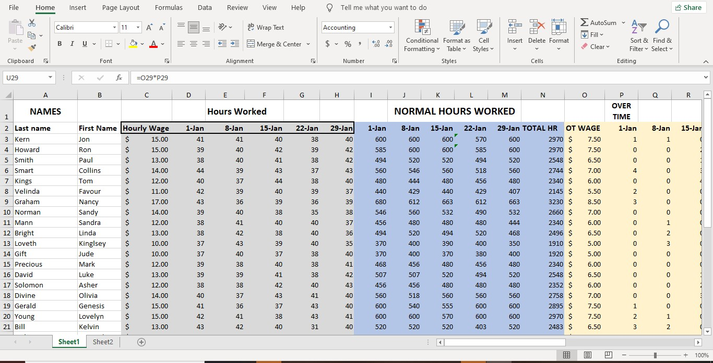
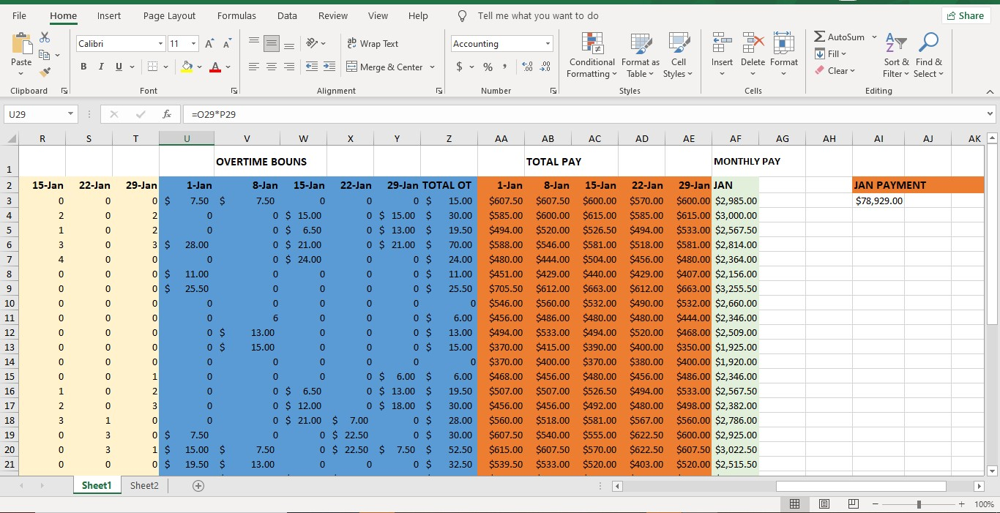

# Employee-payroll-analysis
An Excel Payroll Analysis Project that calculates employee normal pay, overtime bonus, total pay and monthly salary using Excel formulas and payroll logic.

## Introduction
This project is an Excel-based Payroll Management System designed to calculate employee salaries based on hours worked, overtime hours, overtime bonuses, total monthly pay and Jan payment
The project demonstrates how Microsoft Excel formulas and spreadsheet functions can be used to automate payroll calculations for employees in an organization. The payroll sheet contains employee details, working hours across different dates in January, overtime calculations, total monthly salary computations and Jan payment.
This project was created as part of an Excel payroll assignment to strengthen practical skills in Excel formulas, payroll calculations, and spreadsheet modelling.

## Problem Statement
The organization needed a simple payroll system that could:
-	Calculate normal pay for employees based on standard working hours.
-	Identify overtime hours worked by employees.
-	Compute overtime bonuses accurately.
-	Generate the total salary payable to each employee at the end of the month
-	Generate the total January payment.

## Skills Demonstrated
This project demonstrates the following Excel skills:
-	Data organization in Excel
-	Payroll calculation logic
-	IF function usage
-	SUM function usage
-	Arithmetic operations in Excel
-	Spreadsheet modelling
-	Formula replication across rows and columns
-	Data structuring and formatting
-	Payroll analysis

## Data Sourcing
The dataset used for this project was manually provided as part of the payroll assignment.
The original dataset only contained:
- Employee names
- Hourly wage
- Hours worked for different dates
- Additional payroll columns were created during the project to support salary calculations.

Original dataset 
Added payrolls   

## Data Transformation and Cleaning
Several transformations were carried out to prepare the payroll sheet for analysis:
1. Creation of Additional Payroll Columns
New columns were added for:
- Normal Hours Worked
- Overtime
- Overtime Bonus
- Total Pay
- Monthly Pay
- Jan Payment
2. Payroll Logic Standardization
The payroll rules were standardized as follows:
- Standard working hours = 40 hours
- Any hour above 40 = Overtime
- Overtime wage = Hourly Wage ÷ 2
3. Formula Replication
Formulas were copied across all employees and dates to ensure consistent calculations.
4. Currency Formatting
Salary-related columns were formatted in currency values for proper payroll presentation.

## Data Modelling
The payroll model was designed using multiple calculated sections:
- Normal Hours Worked
This section calculates regular employee wages.
Formula used:
Excel Formula
=IF(D3>40,40*C3,D3*C3)

Explanation:
If hours worked are greater than 40:
Employee receives payment for only 40 normal hours.
If hours worked are 40 or below 40:
Employee is paid based on actual hours worked.
- Overtime Wage
Formula used:
Excel Formula
=C3/2

Explanation:
Overtime wage equals half of the employee’s hourly wage.
Example:
Hourly wage = $15
Overtime wage = $7.50
- Overtime Hours
Formula used:
Excel Formula
=IF(D3>40, D3-40, 0)

Explanation:
Calculates extra hours worked above 40.
Returns 0 if employee worked 40 or less than 40 hours.
- Overtime Bonus
Formula used:
Excel Formula
=O3*P3

Explanation:
Overtime Wage × Overtime Hours
Example:
Overtime wage = $7.50
Extra hour = 1
Overtime bonus = $7.50
- Total Pay
Formula used:
Excel Formula
=I3+U3

Explanation:
Normal pay + overtime bonus
- Monthly Pay
Formula used:
Excel Formula
=SUM(AA3,AB3,AC3,AD3,AE3)

Explanation:
Adds total pay across all working dates in January.
- Jan Payment
Formula used:
Excel formular
=SUM(AF3:AF32)

## Visualization
- This project mainly focused on payroll calculation and spreadsheet modelling.

The dataset contains 32 employee records.

You can interact with the report [here](Excel Payroll Project Assignment)

## Analysis 
The payroll analysis revealed:
-	Employees who worked above 40 hours earned overtime bonuses.
-	Employees with higher hourly wages earned larger overtime payments.
-	Monthly salary varied depending on:
-	Hours worked
-	Overtime frequency
-	Hourly wage rate
-	The payroll model successfully automated salary computation and reduced manual calculation errors.

##  Conclusion
The project demonstrates how Excel can be used to:
-	Manage payroll records
-	Calculate overtime automatically
-	Compute employee monthly salaries
-	Organize payroll data efficiently
The system improved calculation accuracy and reduced manual payroll processing.

  

